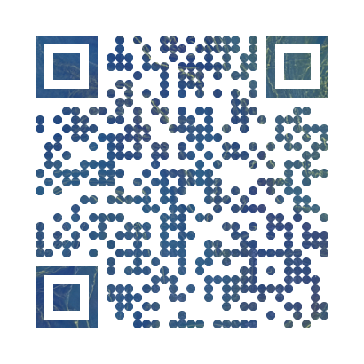

# QR Code Maker

Free online QR code Generators open you up to unfornseen security risks as they can inject their own code and tracking without your knowledge. I decided to use python to create my own custom QR codes.

## Outputs

### Portfolio

### Example vCard

## Sources

* <https://medium.com/@reegan_anne/fully-customizable-qr-codes-in-python-7eb8a7c3b0da>
* <https://github.com/reegan-anne/python_qrcode/blob/main/main.ipynb>
* Landsat Imagery
